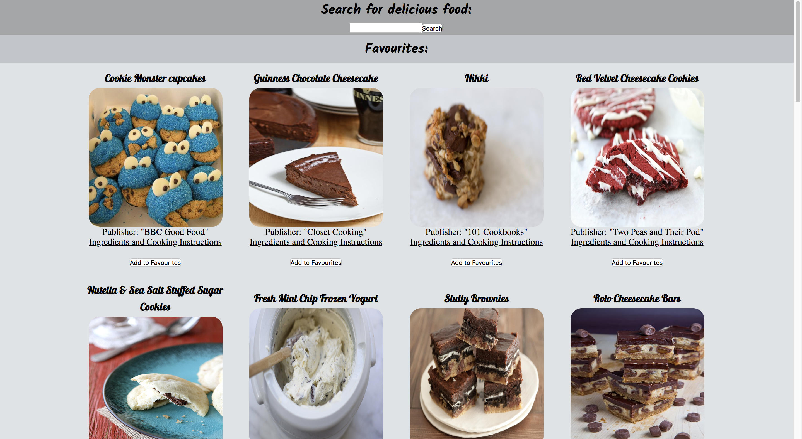

# Your own project

Recipe Search App - web app in which you can search for food recipes using wanted dish ingredient as a keyword. Built with Javascript, CSS flex, React, Express and external API.
Demo app // http://enigmatic-escarpment-98576.herokuapp.com

## Technical notes

- Run `npm install` after cloning to download all dependencies
- Use `npm run dev -- --watch` to build React
- Use `node server.js` to run the Node server in another tab
- You can view the site at [http://localhost:8080](http://localhost:8080)
- If you would like to user `nodemon` to automatically rebuild your server, run `npm run server`
- The node server file is `/server.js`
- The index home page is in `/views/index.hbs`
- Place all static files such as images and CSS in the `static` folder.
